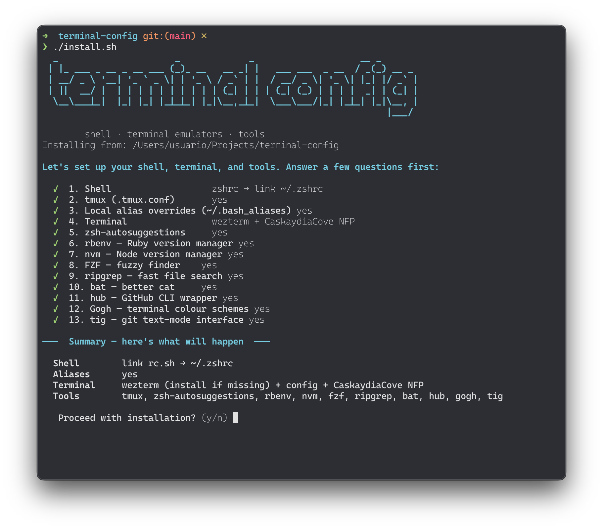
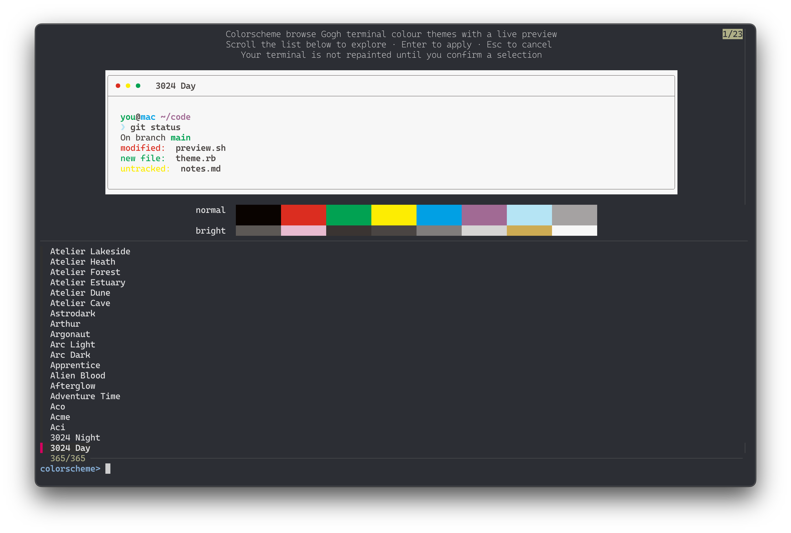

# terminal-config

[](https://github.com/alexesba/terminal-config/actions/workflows/ci.yml)

Personal dotfiles for zsh/bash — robbyrussell-style prompt, theme system, sensible aliases, and one-command setup on macOS, Linux, and WSL.

**Get started** — [Requirements](#requirements) · [Install](#install) · [Update](#update) · [Uninstall](#uninstall)

**Use it** — [Commands](#commands) · [Themes](#themes) · [Color schemes](#color-schemes) · [Customization](#customization) · [Fonts](#fonts)

**More** — [What's included](#whats-included) · [Tools](#tools-installed-by-bootstrap) · [Cross-platform](#cross-platform-notes) · [Tests](#tests) · [Credits](#credits--acknowledgments)

---

## Requirements

- **macOS**: [Homebrew](https://brew.sh) installed
- **Linux / WSL**: `apt-get`, `dnf`, or `pacman`
- **All**: `git`, `curl`, `zsh` or `bash`

---

## Install

```bash
git clone https://github.com/alexesba/terminal-config.git ~/Projects/terminal-config
cd ~/Projects/terminal-config
./install.sh
```

`install.sh` is fully interactive:

1. **Questions** — each prompt collapses to a single `✓` line after you answer (shell, tmux, terminal + Nerd Font, tools, etc.). Re-running defaults to your saved terminal/font from `~/.local.sh`.
2. **Summary** — shows everything that will be installed and asks `Proceed?` before changing anything.
3. **Progress** — runs each step with a progress bar; completed steps become `✓ i/total` lines with detail output kept underneath.

It never overwrites files without backing them up (creates `.old` alongside the original). Say no at the summary step to abort with zero changes.



---

## Update

```bash
cd ~/Projects/terminal-config
./update.sh
```

Pulls the latest changes and refreshes managed shell RC wrappers (and any legacy symlinks still pointing into this repo). Safe to run at any time.

On interactive shell startup, `rc.sh` may fetch upstream (at most once every 4 days) and print a one-line hint when this repo is behind — run `./update.sh` to catch up. Disable with `export TERMINAL_CONFIG_UPDATE_CHECK=0` in `~/.local.sh`.

---

## Uninstall

```bash
cd ~/Projects/terminal-config
./uninstall.sh          # non-interactive — assumes yes to every step
./uninstall.sh -i       # interactive — ask before each step
```

Detaches this machine from the dotfiles repo:

- Removes `~/.zshrc` / `~/.bashrc` wrappers (restores `*.old` if install backed up your previous rc)
- Removes copied configs (`~/.tmux.conf`, terminal emulator configs) — always backed up to `*.uninstall.old` first
- Uninstalls the Nerd Font recorded in `~/.local.sh` (Homebrew cask on macOS, font files in `~/.local/share/fonts/` on Linux)
- Optionally removes empty `~/.bash_aliases` and `~/.config/wezterm/colors.lua`

Does **not** delete the repo, `~/.local.sh`, or other tools installed by `bootstrap.sh` (nvm, fzf, Gogh, TPM, tmux, etc.).

---

## Commands

After `./install.sh` links your shell RC, these functions load from `rc.sh`. Interactive pickers need **fzf** (installed via `./bootstrap.sh --fzf` or during install).

| Command | What it does |
|---|---|
| `help` | Unified fzf menu — edit configs, show bindings, run `colorscheme`, or `use-terminal` |
| `config` | fzf picker for local dotfiles only (`~/.local.sh`, `~/.tmux.conf`, terminal configs, Gogh color files, …) |
| `bindings` | Show keyboard shortcuts (`shell/common/bindings.md`) |
| `colorscheme` | Fuzzy-pick and apply a [Gogh](https://github.com/Gogh-Co/Gogh) theme — see [Color schemes](#color-schemes) |
| `use-terminal` | Point `colorscheme` at another installed emulator for this shell (or auto-detect the hosting window) |
| `reload` | Re-source `~/.zshrc` or `~/.bashrc` to pick up config changes |

**tmux session helpers** (from `lib/tmux_sessions.sh`):

| Command | What it does |
|---|---|
| `tmux-start [dir]` | Create or attach to a session named after the directory |
| `tmux-list` | List sessions with attached/detached status |
| `tmux-switch` | fzf picker to switch sessions |

Common subcommands:

```bash
help --help              # usage
config --help
bindings --help
colorscheme update       # git pull Gogh themes
use-terminal status      # current TERMINAL vs install default
use-terminal detect      # auto-detect hosting emulator
use-terminal reset       # restore TERMINAL from ~/.local.sh
use-terminal kitty apply # switch target and re-apply saved theme
```

In **bash**, `help CMD` still runs the shell builtin; use `help` with no arguments for the dotfiles menu.

Without fzf, `help` and `config` print install hints — use the direct commands (`bindings`, `colorscheme`, `use-terminal`) instead.

---

## Themes

Set `ZSH_THEME` in `~/.local.sh` (the variable is honored by both shells):

```bash
export ZSH_THEME="robbyrussell"   # ➜  project git:(main) ✗
export ZSH_THEME="classic"        # full path + branch + timestamp RPROMPT
```

Themes live in `shell/zsh/themes/` and `shell/bash/themes/`. Copy an existing theme file to create your own.

---

## Color schemes

Run `colorscheme` to fuzzy-pick a terminal color scheme from the [Gogh](https://github.com/Gogh-Co/Gogh) collection (250+ themes). The preview fills the top half of the window; the theme list and prompt sit below.

```bash
colorscheme
colorscheme update    # pull latest Gogh themes (~/src/gogh by default)
```



Press <kbd>Enter</kbd> to apply the highlighted theme. Scrolling the list does not change your terminal — only your final pick is applied.

Themes target the terminal emulator you're running in (Alacritty, Kitty, or WezTerm — chosen at install). New windows and tabs keep the theme after you pick one. If Alacritty theming fails, run `pip install --user -r ~/src/gogh/requirements.txt` (or re-run `./install.sh` / `./bootstrap.sh --gogh`).

If a theme applies to the wrong app, run `use-terminal status` or `use-terminal detect`. See [Commands](#commands) for the full list.

Optional in `~/.local.sh`: `GOGH_DIR` (Gogh checkout, default `~/src/gogh`). Install Gogh via `./bootstrap.sh --gogh` or during `./install.sh`.

---

## Customization

The repo ships **templates** (`*.example`). `install.sh` copies them to your home directory once; after that they are **yours** — edit fonts, keybindings, status bar, etc. without touching git.

| What | Template | Your local file |
|---|---|---|
| Shell overrides | `shell/local.sh.example` | `~/.local.sh` |
| tmux | `tmux.conf.example` | `~/.tmux.conf` |
| Alacritty | `terminal-emulators/alacritty.toml.example` | `~/.config/alacritty/alacritty.toml` |
| Kitty | `terminal-emulators/kitty.conf.example` | `~/.config/kitty/kitty.conf` |
| WezTerm | `terminal-emulators/wezterm.lua.example` | `~/.config/wezterm/wezterm.lua` |

`git pull` updates the templates in the repo; it does **not** change your local copies. To pick up upstream template changes, diff against the `.example` file and merge what you want by hand:

`install.sh` seeds `~/.local.sh` from `shell/local.sh.example` on first run. To create or compare by hand:

```bash
cp shell/local.sh.example ~/.local.sh   # first time only (install.sh does this too)
diff shell/local.sh.example ~/.local.sh # see new example keys
```

For extra aliases only, you can also use a local `~/.bash_aliases` file (not in the repo).

`./update.sh` migrates old dotfiles symlinks automatically: it backs up your current config to `<file>.old`, replaces the symlink with a local copy (preserving your edits), and removes leftover files from the repo (also backed up as `<file>.old`). It never overwrites a config that is already a regular local file.

---

## Fonts

When you pick a terminal emulator during `./install.sh`, you also choose a **Nerd Font** (default: **Caskaydia Cove Nerd Font Propo**). The installer:

1. Installs the font via Homebrew (`brew install --cask font-…`) on macOS, or downloads from [Nerd Fonts releases](https://github.com/ryanoasis/nerd-fonts/releases) on Linux
2. Substitutes `{{FONT_FAMILY}}` in the copied terminal config with your choice
3. Records `TERMINAL_FONT` and `TERMINAL_FONT_ID` in `~/.local.sh` (used on re-run and by `uninstall.sh`)

Reinstall a font standalone:

```bash
./bootstrap.sh --font=caskaydia
```

Available IDs: `caskaydia`, `jetbrains`, `fira`, `hack`.

On WSL, install fonts on the Windows side for GUI terminals.

---

## What's included

| Area | Files |
|---|---|
| **Shell prompt** | `shell/{zsh,bash}/ps1.sh` — theme loaders; `shell/{zsh,bash}/themes/` |
| **Aliases** | `shell/aliases/default.sh` — git, vim, open, navigation (always loaded) |
| **History** | 1 million entries, timestamps, deduplication |
| **NVM** | Auto-switches Node version on `cd` via `.nvmrc` |
| **rbenv** | Ruby version management |
| **Python venv** | Auto-activates `./venv` on `cd` |
| **tig** | Git text-mode browser (`alias tig` in aliases) |
| **FZF** | Fuzzy file finder with `rg`/`bat` preview |
| **zsh-autosuggestions** | History + completion suggestions as you type |
| **tmux** | `tmux.conf.example` — copied to `~/.tmux.conf` (no auto-restore on startup; closing all sessions clears the save) |
| **Terminal emulators** | `terminal-emulators/*.example` — copied to `~/.config/` (not symlinked) |
| **Color schemes** | `colorscheme` — fuzzy-pick 250+ Gogh themes with a live preview |
| **Dotfiles menus** | `help`, `config`, `bindings` — fzf menus to run actions or edit local configs |
| **Terminal switch** | `use-terminal` — fzf menu to target `colorscheme` at another installed emulator for this shell |
| **tmux helpers** | `tmux-start`, `tmux-list`, `tmux-switch` — session create/list/switch |
| **WSL support** | Clipboard, `open` alias, package manager detection |

---

## Tools installed by bootstrap

| Tool | Flag | Purpose |
|---|---|---|
| tmux | `--tmux` | Terminal multiplexer |
| zsh-autosuggestions | `--autosuggestions` | Inline suggestions |
| rbenv | `--rbenv` | Ruby version manager |
| nvm | `--nvm` | Node version manager |
| fzf | `--fzf` | Fuzzy finder |
| ripgrep | `--ripgrep` | Fast file search (used by FZF) |
| bat | `--bat` | Syntax-highlighted cat (used by FZF preview) |
| hub | `--hub` | GitHub CLI wrapper (`alias git=hub`) |
| Gogh | `--gogh` | 250+ terminal color schemes, applied via `colorscheme` |
| tig | `--tig` | Git text-mode interface (used by the `tig` alias) |
| Nerd Font | `--font=ID` | Terminal font (`caskaydia`, `jetbrains`, `fira`, `hack`) |

Run standalone:
```bash
./bootstrap.sh --ripgrep --bat --tig
```

---

## Cross-platform notes

| Platform | Notes |
|---|---|
| **macOS** | Full support. Uses Homebrew for all installs. |
| **Linux** | Detects `apt-get` / `dnf` / `pacman` automatically. |
| **WSL** | `open` alias uses `wslview` (wslu) or `explorer.exe`. Terminal emulator configs belong on the Windows side. |

---

## Tests

CI runs [`./scripts/test.sh`](scripts/test.sh) on every push/PR ([workflow](.github/workflows/ci.yml)). Details, suite list, and manual smoke checklist: **[tests/README.md](tests/README.md)**.

---

## Credits & acknowledgments

This config builds on the work of others:

- **[oh-my-zsh](https://github.com/ohmyzsh/ohmyzsh)** (MIT) — the prompt themes in `shell/zsh/themes/` and `shell/bash/themes/` are reimplementations of oh-my-zsh originals (zsh via native `vcs_info`, bash via `PROMPT_COMMAND`): `robbyrussell.sh` after Robby Russell's [`robbyrussell`](https://github.com/ohmyzsh/ohmyzsh/wiki/Themes#robbyrussell), and `classic.sh` inspired by [`amuse`](https://github.com/ohmyzsh/ohmyzsh/wiki/Themes#amuse).
- **[Gogh](https://github.com/Gogh-Co/Gogh)** (MIT) — the 250+ terminal color schemes used by the `colorscheme` command.
- **[TPM](https://github.com/tmux-plugins/tpm)** and the **[tmux-plugins](https://github.com/tmux-plugins)** suite (`tmux-sensible`, `tmux-resurrect`, `tmux-continuum`) — tmux plugin management and session persistence.
- **[Nerd Fonts](https://github.com/ryanoasis/nerd-fonts)** — patched fonts installed by `install.sh` / `bootstrap.sh --font=…` for terminal emulator configs.

Thanks to all of the above projects and their maintainers.
